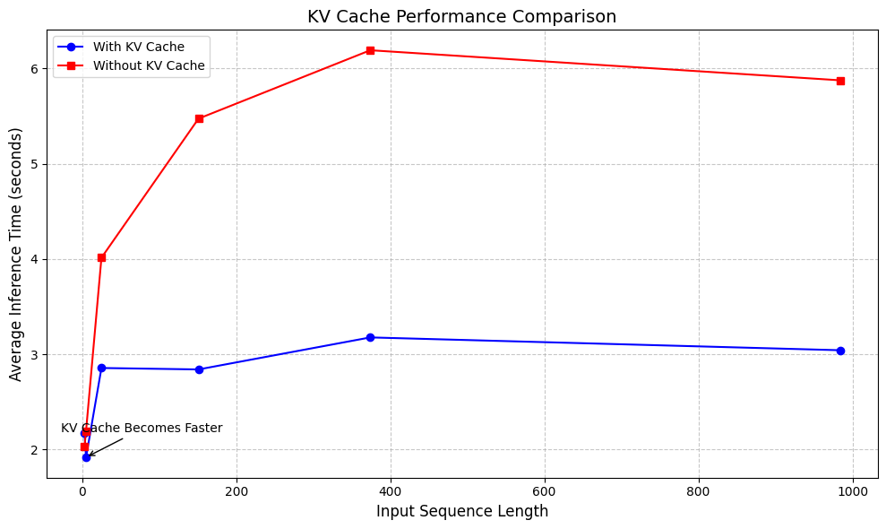

# LLM From Scratch 

In this repository, I am uploading every little code and experiment that I do to build my very own LLM from Scratch, following Sebastian Raschka's book. This also includes implementations and concepts that may not be covered in the book but I cover purely out of my own fascination. 


## List of topics that I augmented to Sebastian's book in this repo 

### Position Embeddings 

1. Sinusoidal Positional Embedding

### Attention Mechanisms 

1. Multi-Query Attention 
2. Grouped Query Attention
3. KV-Cache Mechanism for faster inference. 

## Interesting observations 

### KV Cache inference speed up with increasing sequence lengths 


## Miscellaneous 

### RAG 

RAG involves retrieving most relevant information from a list of document(s) by checking against the query and then providing that retrieved information as context to the LLM prompt before getting the final output from the fine-tuned instruction LLM. Typically, RAG involves using a fine-tuned LLM model as it is and focuses more on the tools used to retrieve "similar" documents in our storage. The retrieval is done based on similarity score of the query with a vector database. This vector database is usually created in tools like `faiss` in Python. A typical workflow looks like this: 

```
import os

# Example: Using Hugging Face Transformers + FAISS as a vector store
from transformers import AutoTokenizer, AutoModel
import torch
import faiss

###############################################################################
# 1. Prepare your data and create embeddings
###############################################################################

# Suppose you have a list of documents or text chunks
documents = [
    "The Eiffel Tower is located in Paris.",
    "The Great Wall of China is over 13,000 miles long.",
    "Paris is the capital city of France, known for the Louvre and the Eiffel Tower.",
    # ... add more doc chunks ...
]

# Load a pre-trained embedding model
# (Any sentence-transformer-like model or HF checkpoint that you trust for embeddings)
embedding_model_name = "sentence-transformers/all-mpnet-base-v2"
tokenizer = AutoTokenizer.from_pretrained(embedding_model_name)
model = AutoModel.from_pretrained(embedding_model_name)

def embed_text(texts):
    """Create vector embeddings from a list of texts."""
    inputs = tokenizer(
        texts, padding=True, truncation=True, return_tensors="pt"
    )
    with torch.no_grad():
        outputs = model(**inputs)
    # Often, for sentence-transformer style, you might take the mean pooled output
    embeddings = outputs.last_hidden_state.mean(dim=1).cpu().numpy()
    return embeddings

# Embed all documents
doc_embeddings = embed_text(documents)

# Create and populate FAISS index
dimension = doc_embeddings.shape[1]
faiss_index = faiss.IndexFlatL2(dimension)      # L2 distance
faiss_index.add(doc_embeddings)

###############################################################################
# 2. Define a retrieval function
###############################################################################

def retrieve_top_k(query, k=2):
    """Retrieve top-k most similar document chunks to the query."""
    query_embedding = embed_text([query])
    distances, indices = faiss_index.search(query_embedding, k)
    return [(documents[i], distances[0][idx]) for idx, i in enumerate(indices[0])]

###############################################################################
# 3. Combine retrieved chunks + user query -> feed into your LLM
###############################################################################
def generate_answer(user_query):
    # 1) Retrieve relevant chunks
    top_docs = retrieve_top_k(user_query, k=2)
    
    # 2) Construct a prompt that includes the retrieved docs
    context = "\n".join([f"- {doc[0]}" for doc in top_docs])
    prompt = f"""
Use the following context to answer the question. 
Context:
{context}

Question: {user_query}
Answer:
"""
    # 3) Call your LLM with the prompt (pseudo-code or actual model call).
    #    Below is just a placeholder; you'd replace this with your
    #    model’s generate function (e.g. HF’s pipeline or OpenAI API).
    #    Example shown with a hypothetical 'llm_generate' function:
    # answer = llm_generate(prompt)

    answer = f"(LLM output goes here, using the prompt)\nPrompt was:\n{prompt}"

    return answer

###############################################################################
# 4. Use the pipeline
###############################################################################
if __name__ == "__main__":
    query = "Where is the Eiffel Tower?"
    final_answer = generate_answer(query)
    print("Final Answer:\n", final_answer)

```